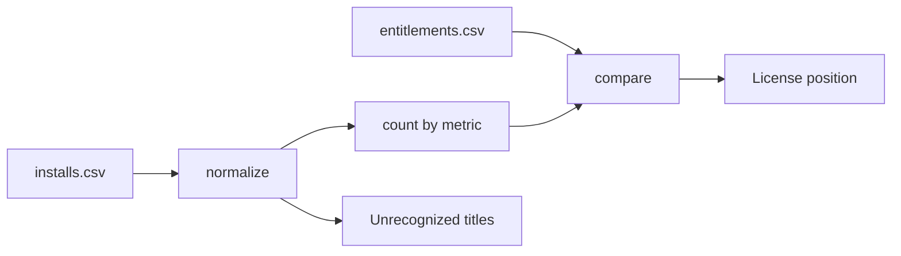

# sam-license-reconciler

Reconciles discovered software installs against entitlements and reports the license position per product: owned, consumed, shortfall cost and unused spend.

> **Portfolio project.** Written independently as a clean-room demonstration. It contains no employer or client code, configuration or data. All sample data is synthetic.

## Business use case

Before an audit or a renewal, an asset team needs to know where it is under-licensed (audit exposure) and where it is paying for rights nobody uses. This project walks through the same steps Software Asset Management tooling performs, on a small dataset where every result can be checked by hand.

## How it works

1. **Normalize** discovered display names to a publisher and product ("NW Office Professional" and "Northwind Productivity Suite" are the same product).
2. **Count consumption** under the license metric: per device, per user, or per core with a four-core minimum per device.
3. **Compare** with entitlements and price the difference.



## Run it

No dependencies beyond Python 3.11+.

```bash
python -m samrecon --installs sample_data/installs.csv --entitlements sample_data/entitlements.csv
```

```
Product                     Metric       Owned  Used   Bal  Status            True-up   Savings
Acme Database Server        per_core        16    20    -4  NON-COMPLIANT     1800.00      0.00
Globex Diagram Pro          per_user         2     2     0  COMPLIANT            0.00      0.00
Northwind Office Suite      per_device       5     4     1  OVER-LICENSED        0.00    120.00
WARNING not normalized, needs a rule: Initech Screen Grabber
```

The exit code is 1 when any product is non-compliant, so the check can gate a pipeline.

## Tests

```bash
python -m unittest discover -s tests -v
```

11 tests cover normalization variants, one right per device for repeat installs, case-insensitive user counting, the per-core minimum, installs with no entitlement and rejected metric data.

## Security notes

Publishers, products, prices, devices and users are invented. Real entitlement and contract data is commercially sensitive and should not be committed here.

## Limitations and next steps

- Normalization is a short rule list. Real tooling uses a maintained content library.
- No downgrade rights, suite bundling, virtualization rules or subscription dates.
- Reads CSV only.

## License

MIT
